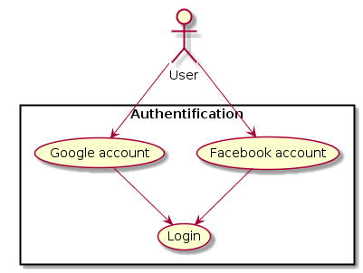
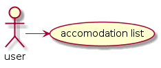

\pagebreak

### 2.2.1 User use case
 
**Use case:** account management

**Diagram:**

**Brief Description**

Each user can register/connect in a simple way with a facebook or a google account. After creation of an account, a user can manage it.

**Initial Step-By-Step Description**

1. The user chooses to login with a Facebook or a Google account on the mobile app.
2. The server receives an authentification token and user data, log in the user.
3. The server sends back the user data to the mobile app, the user is now connected. 

---

**Use case:** list accommodation

**Diagram:**

**Brief Description**

Each user can access to the available accommodations list shown on a map.

**Initial Step-By-Step Description**

1. The mobile app asks the server to have the available accommodations list.
2. The server sends back the accommodations list.
3. the mobile app connect to google map to have a map.
4 . the mobile app show to the user a map of Manipal with accommodations location.
 
---

**Use case:** list accommodation filtred

**Diagram:**

**Brief Description**

The user can select a filter to help him to find an accommodation that fit is needed.

**Initial Step-By-Step Description**

1. The user define his filter in the mobile app
2. the mobile app send a request to the server to get a filter accommodations list.
3. the server send back the filtered accommodations list.
4. the mobile app updates the map with the new accommodations locations.

---

**Use case:** get accommodation details

**Diagram:**

**Brief Description**

The user can access to more details when he selects an accommodation.

**Initial Step-By-Step Description**

1. The user touches an accommodation on the map.
2. the mobile app send a request to the server to get the accommodation details.
3. the server send back data for a given accommodation.
4. the mobile app show accommodation detail.
 
---

**Use case:** create temporal agreement

**Diagram:**

**Brief Description**

The user can choose an accommodation that fit his needs, a create a tempory agreement. A tempory agreement is an agreement that the owner have to validate before.

**Initial Step-By-Step Description**

1. The user ask to make a temporal agreement to an accommodation
2. the mobile app send a request to the server to create a tempory agreement linked to the accommodation, between the user and the owner.
3. the server send back a validation
4. the mobile app show a validation
 
---

**Use case:**  list all chats

**Diagram:**

**Brief Description**

The user can chat with many owners. Every time a temporal agreement is made, a chat is created between the user and the owner.

**Initial Step-By-Step Description**

1. The user click on "chat" on the side menu
2. The mobile app request the server to have an available chat list
3. The server send back the available chat list
4. the mobile app show the available chat list to the user

---

**Use case:**  select a chat to interact with

**Diagram:**

**Brief Description**

The user can select a chat to interact with.

**Initial Step-By-Step Description**

1. The user click on "chat" on the side menu
2. The mobile app request the server to have access to this chat
3. The server send back data and the history conversation about the given chat
4 . the mobile app show the data and history conversation for the previously selected chat

---

**Use case:**  send a message in a chat

**Diagram:**

**Brief Description**

The user can send a message to a chat.

**Initial Step-By-Step Description**

1. When a chat is selected, the user can write a message
2. The mobile app show back the type message
3. The user click on "send"
4. The mobile app send the message to the server
5. The server send back an acknowledgment of receipt
6.  The mobile app show to the user that the message is well sent.

---

**Use case:**  receive a message from chat

**Diagram:**

**Brief Description**

The user can receive a message from a chat when he is connected to the app.

**Initial Step-By-Step Description**

1. When a new message sends by the other user in a chat, the server sends this message to the user.
2. the mobile app receive the message from the server.
3. The mobile app shows the new message to the user.
